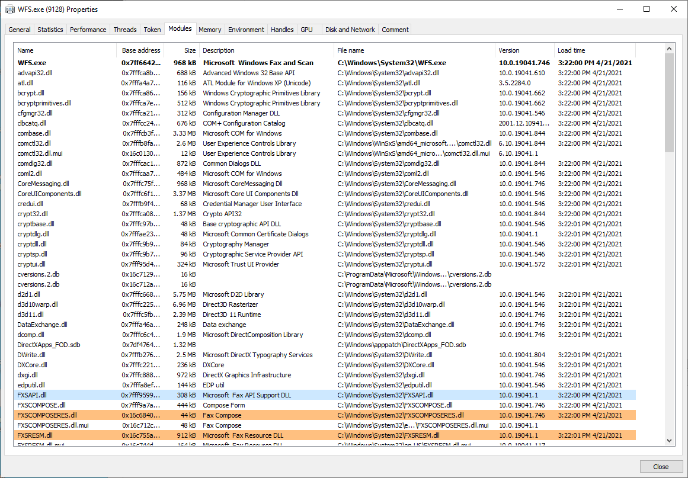
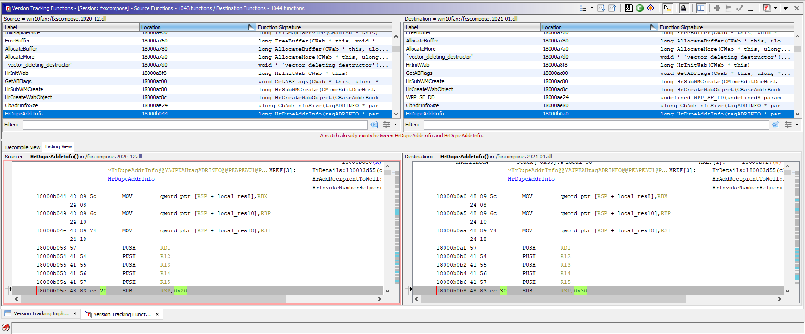
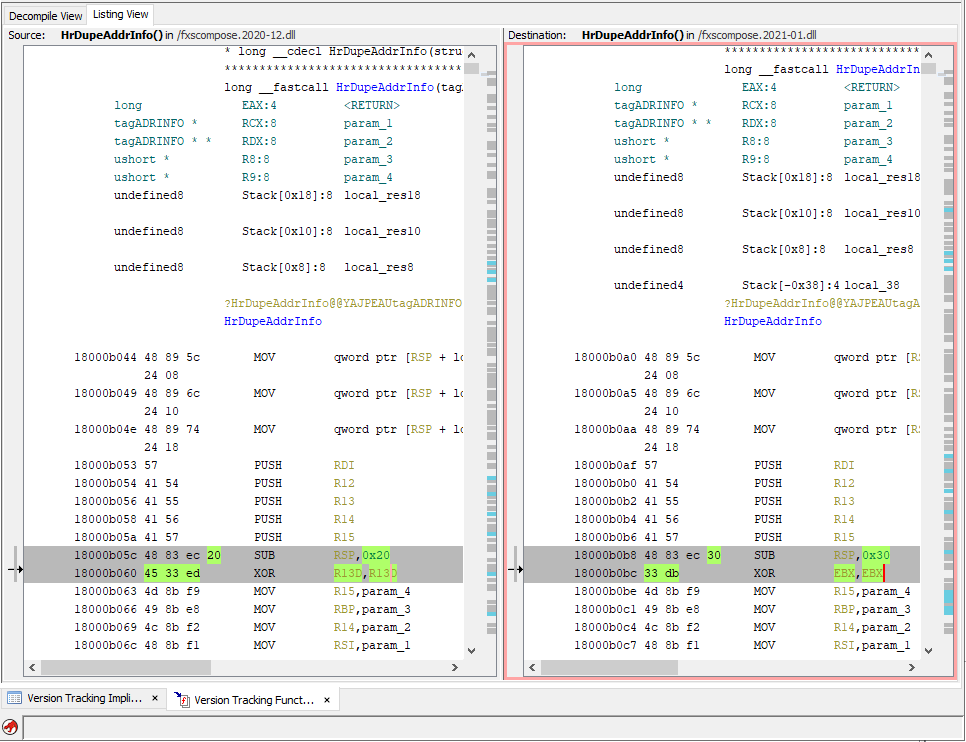
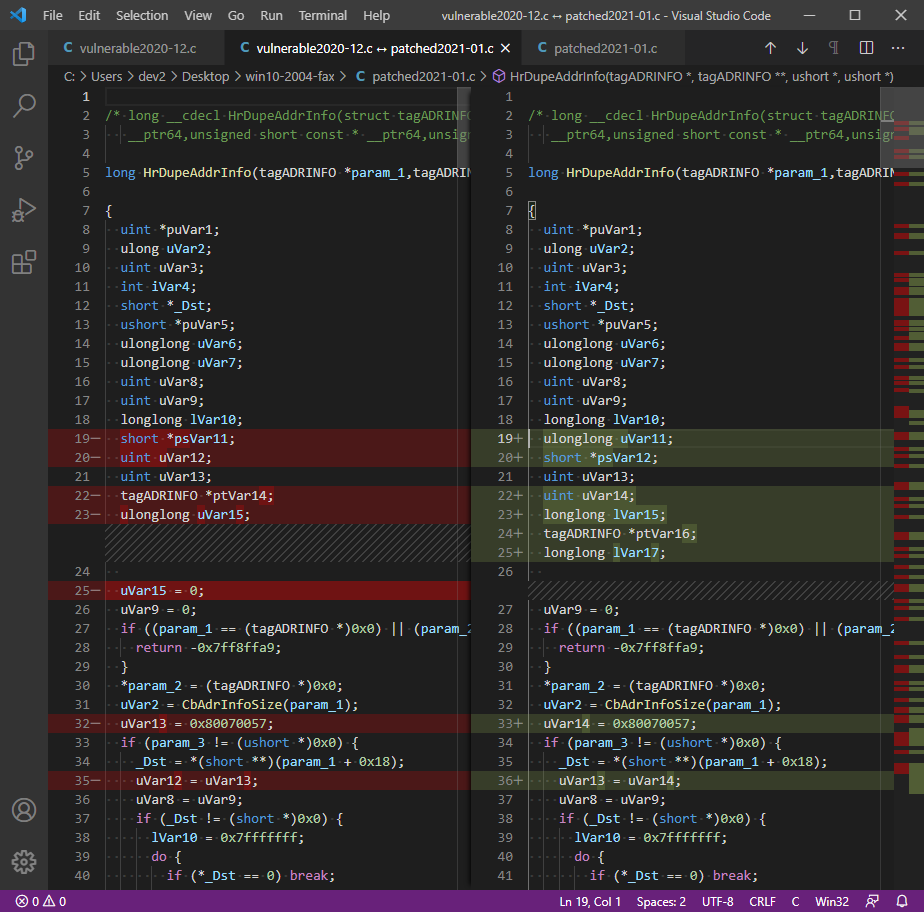
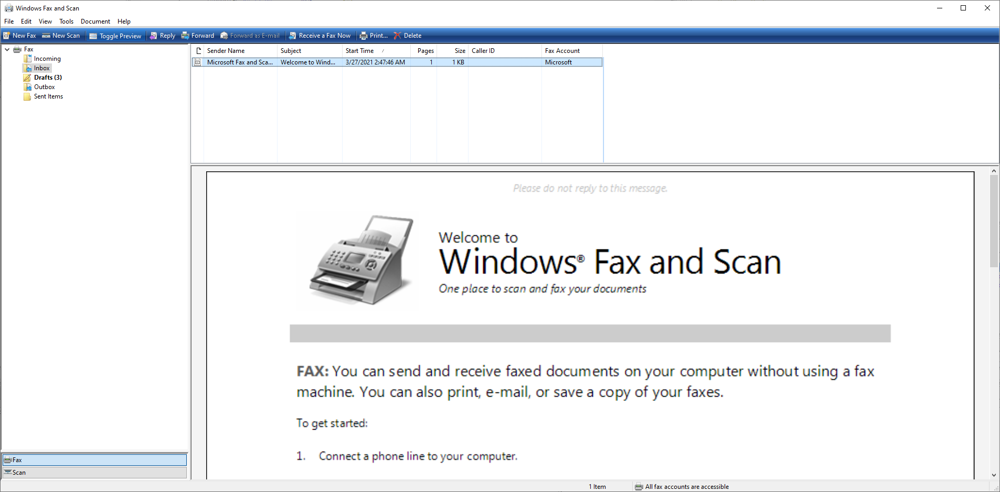
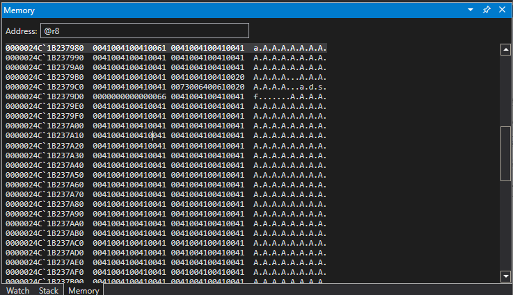
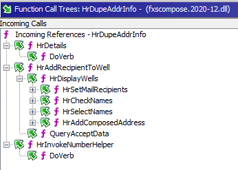

# Patch Diffing in the Dark
---
# CVE-2021-1657 - Getting Started
created: 2021-04-15
author: John M

 <sub>Photo by [Jonatan Pie](https://unsplash.com/@r3dmax?utm_source=unsplash&utm_medium=referral&utm_content=creditCopyText) on [Unsplash](https://unsplash.com/s/photos/patch-dark?utm_source=unsplash&utm_medium=referral&utm_content=creditCopyText)</sub>

## The Basics
> Binary code similarity approaches compare two or more pieces of binary code to identify their similarities and differences. The ability to compare binary code enables many real-world applications on scenarios where source code may not be available such as patch analysis, bug search, and malware detection and analysis. [Survey of Binary Code Similarity](https://arxiv.org/abs/1909.11424)

Patch diffing, a specific form of binary diffing, is a technique to identify changes across versions of binaries as related to security patches. Today, all major OS vendors provide security patches (or updates) to provide additional features and patch vulnerabilities. The value in patch diffing mainly applies to proprietary or closed source software where the changes are not revealed in source. It is used by security [researchers](https://googleprojectzero.blogspot.com/2017/10/using-binary-diffing-to-discover.html), malicious [attackers](https://securityaffairs.co/wordpress/3913/cyber-crime/1-day-exploitsbinary-diffing-patch-management-the-side-threats.html), and even as the foundation of at least one company's [business model](https://blog.0patch.com/) to provide the insight and information needed to understand the latest security vulnerabilities. In that same vein, I intend to show **the value of patch diffing for vulnerability comprehension and discovery**.


### High Level
A patch diff compares a vulnerable version of a binary with a patched (or fixed) version. The intent is to highlight the changes, helping to discover *new*, *missing*, and *interesting* functionality across various versions of a binary.

```mermaid

flowchart LR;
linkStyle default interpolate basis

funcA1234<--Match 85%-->funcB2348
funcA1235<--Match 100%-->funcB2347
funcA1236<--Match 100%-->funcB2345
funcA1237<--Match 100%-->funcB2349

subgraph Binary Version B - patched
	funcB2345	
	subgraph NewFunc
		funcB2346
	end
	funcB2347
	subgraph Interesting
		funcB2348		
	end
	funcB2349
end

subgraph Binary Version A - vulnerable

	funcA1234
	funcA1235
	funcA1236
	funcA1237
	subgraph Missing
		funcA1238
	end
end

```
<sub> *Depiction of a patch diffing session finding new, missing, and interesting functions* </sub>

By focusing solely on the differences you are quickly directed to security relevant areas and problematic code.
  
## Putting My Money Where My Mouth Is
 
While reading several articles about vulnerability research, I started to see a pattern of several researchers leveraging past CVEs for the basis of their new security research. Several were using patch diffing to see more clearly. In my [research and learning](https://cve-north-stars.github.io/) on the topic, I started to believe that:

>Patch Diffing: 
>- is **a single source of truth** when there is no other information
>- **provides clarity** in vulnerability comprehension and discovery
>- can be an excellent candidate for **improving your competence** via deliberate practice. It is complex and challenging yet tractable with the help of today's SRE tooling.

These thoughts emerged from studying *other's* success and failures during their patch diffing analysis.  It was time for me to give it a go.

## One Friday Afternoon...

This story begins on a Friday afternoon when I attempted to put my money where my mouth was. The time had come to prove out of these ideas that I had seen others take advantage of. I wanted to attempt a patch diff on a CVE that I knew nothing about. No help from recent blog posts or hints as to what the problem was besides the single CVE and the description of the vulnerability. This patch diff would happen **in the dark** and be my *single source of truth*.

### Finding a CVE to Diff

To begin, I searched for CVEs related to the the [Windows Fax Service](https://docs.microsoft.com/en-us/previous-versions/windows/desktop/fax/-mfax-about-the-fax-service).  I had been interested in looking at another Windows service after concluding my research of the Windows Print Spooler. I thought this would be a good start. 

The first step was to see what was available by [searching the CVE list for "windows fax"](https://cve.mitre.org/cgi-bin/cvekey.cgi?keyword=windows+fax):

Taking a quick look at the vulnerabilities, I chose the first CVE in 2021: 

> [CVE-2021-1657](https://cve.mitre.org/cgi-bin/cvename.cgi?name=CVE-2021-1657) Windows Fax Compose Form Remote Code Execution Vulnerability

This single description sentence and the fact that they introduced the patch within a specific month were my only two pieces of information to begin.  From this description of CVE-2020-1657 I made the following assumptions:
- **Fax Compose Form** - Related to fax service or fax applications. Happens when composing fax? Maybe.
- **Remote** - This vulnerability can gain execution across a network boundary. 

### Getting the Patches
To perform a diff, you need two binaries. A copy of the patched binary, and a vulnerable one. Each Windows binary is versioned with a build number. Essentially, you want to grab a copy patched binary and a "N-1" version or a version < the patched one. 

Getting Microsoft patches for a CVE is pretty straightforward.  

```mermaid

graph LR;

A[CVE] --> B[MSRC info page];
B --> C[KB article];
C --> D[MUC site];
D --> E[MSU archive]


```

Do this once for the cumulative [update tied to the CVE](https://support.microsoft.com/en-us/topic/january-12-2021-kb4598279-monthly-rollup-960a4633-06e4-5b2e-a6f5-bf8f0567871f)  and again for the cumulative update from the [month before](https://support.microsoft.com/en-us/topic/december-8-2020-kb4592471-monthly-rollup-dba1c9da-232c-e176-98be-8d9d277e46db) (the N-1).   After you have the patches, you will need to [extract them](https://wumb0.in/extracting-and-diffing-ms-patches-in-2020.html).

I started by downloading the Windows 7 x64 versions of the binaries, as typically Windows 7 updates have a [greater signal to noise ratio](https://googleprojectzero.blogspot.com/2020/04/tfw-you-get-really-excited-you-patch.html), from the two sets of patch directories. Each binary is located in a folder that contains the [version number](https://docs.microsoft.com/en-us/dotnet/api/system.version?view=net-5.0#remarks) of the binary.  

Microsoft Version Number for binaries within the update: 

> major.minor.build.revision

You can see which binaries updated by looking for updated comparing version numbers across the two folders. 

```bash
$ diff -qr 2020-12/x64/ 2021-01/x64/ 

Only in 2020-12/x64/: e..riseclientsync-host_7.2.7601.24559
Only in 2021-01/x64/: e..riseclientsync-host_7.2.7601.24564
Only in 2020-12/x64/: e..vironment-os-loader_6.1.7601.24563
Only in 2021-01/x64/: e..vironment-os-loader_6.1.7601.24564
Only in 2020-12/x64/: f..client-applications_6.1.7601.24560
Only in 2021-01/x64/: f..client-applications_6.1.7601.24564
Only in 2020-12/x64/: fsrm-service_6.1.7601.24561
Only in 2021-01/x64/: fsrm-service_6.1.7601.24564
Only in 2020-12/x64/: hal_6.1.7601.24563
Only in 2021-01/x64/: hal_6.1.7601.24564
```

From the monthly cumulative patches (which contain all updated binaries from that point and time) you can determine specifically updates to the *revision* component of the version number. 

```bash
$ diff -qr 2020-12/x64/ 2021-01/x64/ | grep 2021

Only in 2021-01/x64/: cpu.inf_6.1.7601.24564
Only in 2021-01/x64/: crypt32-dll_6.1.7601.24564
Only in 2021-01/x64/: cryptbase_6.1.7601.24564
Only in 2021-01/x64/: cryptnet-dll_6.1.7601.24564
Only in 2021-01/x64/: cryptsvc-dll_6.1.7601.24564
Only in 2021-01/x64/: csrsrv_6.1.7601.24564
Only in 2021-01/x64/: e..environment-windows_6.1.7601.24564
Only in 2021-01/x64/: e..riseclientsync-host_7.2.7601.24564
Only in 2021-01/x64/: e..vironment-os-loader_6.1.7601.24564
Only in 2021-01/x64/: f..client-applications_6.1.7601.24564
Only in 2021-01/x64/: fsrm-service_6.1.7601.24564
Only in 2021-01/x64/: hal_6.1.7601.24564
Only in 2021-01/x64/: installer-engine_6.1.7601.24564
```

There were **89** updated packages (or that at least increased their revision number) in total. 

### Which Binaries to Diff?
Determining which binary to diff for an update takes a bit more work. Which binary changed for the patch? Which one applies to the CVE? What is a "Fax Compose Form"??? Does it being remote have some implications? Again, I am trying to go *from a single sentence to victory*. 

There is a bit of an art to even knowing which binaries to diff. Sometimes it may be more [obvious](https://cve.mitre.org/cgi-bin/cvename.cgi?name=CVE-2020-1048), but typically you will need to do some digging or have some prior knowledge about your software and dependencies. 

> ... my patch diffing adventure did not turn out with me analyzing the bug I intended ...  it turns out I analyzed and wrote a crash POC for not CVE-2019-1458, but actually CVE-2019-1433.  [Maddie Stone -Project 0](https://googleprojectzero.blogspot.com/2020/04/tfw-you-get-really-excited-you-patch.html)

It's easy to get it wrong. We are starting from little to no information and nothing is guaranteed. You could spend a lot of time to find absolutely nothing. This alone might be an argument against patch diffing in the first place, but I will argue from my three conclusions that it's still worth the effort.  

OK, you need to get a copy of the vulnerable binary relevant to the CVE. To get an idea of which binaries relate to the patch I loaded up the Fax and Scan app (`WFS.exe`) on Windows and also kicked off the Windows Fax service (`FXSSVC.exe`). From tools like Process hacker, you can see which modules are loaded for each process.  



Ignoring standard libs and other common Dlls (`kernel32.dll`, `msvcrt.dll`, etc.) it seems like most fax applications rely on modules that have a prefix of `FXS` with `FXSsomething.[dll|exe]`.  

```bash

$ find 2020-12 | grep fxs
2020-12/f..client-applications_6.1.7601.24560/fxscompose.dll
2020-12/f..client-applications_6.1.7601.24560/fxscomposeres.dll
2020-12/f..client-applications_6.1.7601.24560/fxscover.exe
2020-12/f..client-applications_6.1.7601.24560/fxsutility.dll

$ find 2021-01 | grep fxs
2021-01/f..client-applications_6.1.7601.24564/fxscompose.dll
2021-01/f..client-applications_6.1.7601.24564/fxscomposeres.dll
2021-01/f..client-applications_6.1.7601.24564/fxscover.exe
2021-01/f..client-applications_6.1.7601.24564/fxsutility.dll

```

Turns out that `f..client-applications` was updated with this particular patch from *24560* to *24564*. Notice as well that there are no binary updates for the Windows Fax Service (`FXSSVC.exe`).  It looks like **I'm not even looking at CVE in the software I intended**. I'm already getting it wrong, but I carry on as this might relate to the Fax Service.

### Finding My Glasses

I now have my binaries (apparently for the Fax and Scan App) and it's time to prep for patch diffing.  

To patch diff you need:
- Source Binary (vulnerable)
- Destination binary (patched)
- SRE tooling
- Symbols

Ok. You won't always have symbols. But I want them.  It turns out symbols are really helpful for understanding when looking at the assembly or decompiled code. Symbols give SRE tools the lenses they need to perform patch diffing more efficiently and effectively. 

I was able to get the symbols for the previous version (N-1 from December):
```powershell
PS C:\Users\user\win7fax\2020-12\x64\f..client-applications_6.1.7601.24560>
symchk /r /v /s SRV*c:\symbols*https://msdl.microsoft.com/download/symbols .
.
.
<output surpressed>
.
.
SYMCHK: FAILED files = 0
SYMCHK: PASSED + IGNORED files = 7
```

But not for the patched version (January 2021):
```powershell
PS C:\Users\user\win7fax\2021-01\x64\f..client-applications_6.1.7601.24564>
symchk /r /v /s SRV*c:\symbols*https://msdl.microsoft.com/download/symbols .
.
.
<output surpressed>
.
.
SYMCHK: FAILED files = 4
SYMCHK: PASSED + IGNORED files = 3
```

Sometimes the symbol files [aren't there](https://social.msdn.microsoft.com/Forums/en-US/7eb875cf-f95f-4250-8cb6-d63ac3e86b3b/some-debug-symbol-files-for-windows-10-are-missing-in-microsoft-symbol-server?forum=windbg), or maybe they got lost or there was a typo? I tried to move forward patch diffing without symbols, but the tool I'm using Ghidra Version Tracking Tool, could not adequately figure out which functions matched. (\*Later I found out that Ghidra *was* able to find the diff, it just required a few extra steps I didn't know at the time.)

In the end I had to resort to Windows 10 binaries.  For Windows 10, the process to generate actual binaries to even start the diffing process is [a chore in itself](https://wumb0.in/extracting-and-diffing-ms-patches-in-2020.html). It involves downloading the updates, unpacking them, using the differentials in the update to revert your current binary (installed on your running system) to version 1, then forward patching it to the version specified in the update. 

Generating binary that was patched:
```bash
python .\delta_patch.py -i C:\Windows\System32\FXSCOMPOSE.dll -o fxscompose.2021-01.dll C:\windows\WinSxS\amd64_microsoft-windows-f..client-applications_31bf3856ad364e35_10.0.19041.746_none_56f2f7338735a9a6\r\FXSCOMPOSE.dll .\2021-01\x64\f..client-applications_10.0.19041.746\f\fxscompose.dll
```

Generating binary that is vulnerable (N-1):
```bash
python .\delta_patch.py -i C:\Windows\System32\FXSCOMPOSE.dll -o fxscompose.2020-12.dll C:\windows\WinSxS\amd64_microsoft-windows-f..client-applications_31bf3856ad364e35_10.0.19041.746_none_56f2f7338735a9a6\r\FXSCOMPOSE.dll .\2020-12\x64\f..client-applications_10.0.19041.508\f\fxscompose.dll

```

That's right, Windows 10 distributes the patches as binary diffs that require you to  run some scripts to generate the original binary.  So you need the diffs from the patches to generate the actual binaries to then patch diff to have a chance to understand the delivered patches. You still with me?

I also heard about the ability to just [download an arbitrary binary outright](https://www.winhelponline.com/blog/download-missing-system-files-dll-exe-sys-from-microsoft-site/) by leveraging this [site](https://winbindex.m417z.com/?file=fxscompose.dll), but followed the technique in the link above of generating the binary's using the binary diffs supplied in the patch MSU file.  

For Windows 10, both the symbols for the patched vulnerable (N-1) version were available. I then had everything I needed to proceed. 

### Patch Diffing With Ghidra

The SRE tool I chose was [Ghidra](https://ghidra.re/). Why? It's open source (ie. convenient and free) and I found it to be quite good on documentation and examples. Through my patch diffing research, I learned how to use Ghidra's *Version Tracking Tool*. This tool was originally meant for porting your previously reversed binary annotations to a new version of the binary.  It would help figure out which functions remained the same across new versions. Within the *Version Tracker Tool*, is a set of correlators. The correlators provide algorithms or methods that take various inputs (basic blocks, data, functions) and create associations between the two binaries and score them based on some heuristic. 


The correlators need to be run in some order that will reveal the differences. One particularly suitable method for patch diffing is the *Automatic Version Tracking* action. It intuitively runs the most obvious (exact) correlators first to increase match accuracy.  

>The Automatic Version Tracking  action uses various correlators in a predetermined order to automatically create matches, accept the most likely matches, and apply markup all with one button press. The following correlators are run in this order:
> - Exact Symbol Name Correlator
> - Exact Data Correlator
> - Exact Function Bytes Correlator
> - Exact Function Instructions Correlator
> - Exact Function Mnemonics Correlator
> - Duplicate Function Instructions Correlator
> - Combined > - Function and Data Reference Correlator  [Ghidra Docs]()

For patch diffing, this is the preferred method.

These correlators run through and make create matches between functions across the two binaries. Some binaries, depending on their size, will have 5K to 35K+ functions. There is quite a bit of work to do.  There is a whole art even to running the patch diffing session, and you, as an analyst, have some manual work to do once all the correlators have done their work. 

### Diffing fxCompose.dll

There are several candidate files in this patch for CVE-2021-1657:
- `fxscompose.dll` - Compose Form
- `fxscover.exe` - Microsoft Fax Page Cover Editor
- `fxsutility.dll` - Fax Utility DLL
- `wfs.exe` - Windows Fax and Scan App

Being that the CVE talks about the Fax Compose Form, I began with `fxscompose.dll`. 

At a high level, the patch diff process in Ghidra is:
1.  Load binaries into Ghidra Version tracking tool
2.  Auto-analyze binaries (using Ghidra's built in analysis)
3. Run Automatic Diffing Tool Action
4. Evaluate Matches
5. Run more correlators. Go back to step 4. (if needed)

The end result for `fxscompose.dll` was: **No diffs found**.

This implies that the binaries are the same.  However, while Ghidra's built-in correlators do a pretty good job to match functions, they have a few blind spots. 

#### Boosting the signal
When using the *symbol match* correlator, Ghidra will mark functions equivalent if they have the same symbol name, regardless of the content. That means that matches between two functions with the same name have a perfect score of 1.0  (despite potential differences). This hides everything but the discovery of new or deleted functions. Luckily someone created a new correlator to handle this very issue called [PatchDiffCorrelator](https://github.com/threatrack/ghidra-patchdiff-correlator/tree/master/PatchDiffCorrelator). It will run some heuristics on the already matched functions and give a score below 1.0.

Running that correlator reveals one changed function:
> `HrDupeAddrInfo`  0.84 % match ( leveraging PatchDiffCorrelator)

I'm quite green, but this seems like an ideal scenario. This patch diff session ended up with a **single function being changed**.  Other sessions I have had 20+ functions changed, and even that is difficult to wade through. Ghidra has removed the noise of all the functions that haven't changed and has given me a clear signal that this function is interesting. Probably. 

### Comparing HrDupeAddrInfo

Using the lower pane of the Version Tracker View you can quickly take a look at the diffs. It supports two different views of the functions. 



#### Assembly

Quick Observations:
 - Stack is bigger. More local variables. 
 - ETW Tracing Added


<sub> Ghidra Version Tracking Tool Lower Pane Comparison </sub>

#### Decompilation

Quick Observations:
- New and Changed variables 
	- Some variables have gone from `ulong` to `ulonglong`
	- Looks like some from `int` to `uint`


<sub> Ghidra's decompilation viewed in VS Code Diff </sub>

From these observations some things immediately stand out. Looks like they added some additional variables and increased some sizes (`ulong` to `ulongong`), a function call, and changed the "signedness" (`int` to `uint`) of some of the variables. Very interesting. Maybe an integer overflow issue?

### Believing

At this point, I was already convinced. A single function changed. Somewhere in this very function is a bug!  This function has an integer overflow and I'm going to find it!  

Back to the description. My light in the otherwise dark.

> [CVE-2021-1657](https://cve.mitre.org/cgi-bin/cvename.cgi?name=CVE-2021-1657) Windows Fax Compose Form Remote Code Execution Vulnerability

Within this function is a change that prevents someone from gaining code execution. The the fact that it is remote might mean that this object can be sent via Fax? Or some other network boundary crossing mechanism??

### Auditing HrDupeAddrInfo

Taking a look at the function, I tried to see if I could see the vulnerability straight away.  

##### Function Prototype

```c
long HrDupeAddrInfo(tagADRINFO *p1,tagADRINFO **p2,ushort *p3,ushort *p4)
```

From the function prototype and name (`HrDupeAddrInfo`) some assumptions can be made. Likely this function takes a pointer to an already created (or allocated) object `p1` and makes a copy (`Dupe`) and sets a pointer to it as `p2`.  These objects are some pointer to a structure called `tagADRINFO`?  Not sure what `p3` or `p4` are.  

##### Function Call Tree - Outgoing Calls


From Ghidra's *Function Call Tree* Window, specifically the outgoing call list, in the *Source Code Browser* (the code browser open with the vulnerable binary) you can get a birds eye view of what the function is doing by seeing what functions are called within it. 

- `CbAdrInfoSize` - calculate size
- `MemAlloc` - allocate memory
- `memset` - set memory
- `StringCchCopyW` - copy data (string)
- `memcpy` - copy data

It was calculating a size based on the object passed in and storing the result in an `unsigned long`. 

```c
uVar2 = CbAdrInfoSize(param_1);
```

This is good (or bad depending on your goal). On Windows, an `unsigned long` is [4 bytes](https://docs.microsoft.com/en-us/cpp/cpp/data-type-ranges?view=msvc-160). A bit strange as on a x64 bit system you would assume a `long` to be 8 bytes. Windows is accounting for a time when it lived in a 16-bit world, when `long` meant 4 bytes. The good news about an unsigned long being 4 bytes (max being ~4.1 GB) is that there might be some way to overflow it.  

The function then makes a new memory allocation based on that calculated size of the first object, then pass the address of the destination object `p2` or `param_2` and `unsigned long` size calculated `uVar9` to MemAlloc.  

```c
  uVar9 = uVar2 + 7 & 0xfffffff8;
  iVar4 = MemAlloc(param_2,uVar9);
```

After filling the new allocation with 0s (`memset`), it copies both string and binary data from the first object `p1` (`param1`) to the second `p2` (`param2`).

```c

uVar7 = (ulonglong)uVar9;
memset(*param_2,0,(ulonglong)uVar9);
ptVar14 = *param_2;
_Dst = (short *)((ulonglong)(ptVar14 + 0x6f) & 0xfffffffffffffff8);
if (*(longlong *)(param_1 + 8) != 0) {
StringCchCopyW(_Dst,(ulonglong)(ptVar14 + (uVar7 - (longlong)_Dst)) >> 1,
			   *(longlong *)(param_1 + 8));
				  
```

For this analysis I was mostly looking at the decompilation, as it is much easier to read than the assembly. After about 30 mins, I could speculate about the issue, but decided I didn't know enough about the function. I still couldn't see the vulnerability clearly. At this point I decided to pivot. Perhaps if I could see the data or object passed to the function I could see more clearly. 

### Enter Windbg 

Time for a switch to dynamic analysis. I ran `WFS.exe` and attached to it with [WinDbg](https://docs.microsoft.com/en-us/windows-hardware/drivers/debugger/getting-started-with-windbg).  



#### Triggering the BP
First, how do I reach this function? What kind of data is this manipulating?  `HrDupeAddrInfo`? Perhaps some sort of address? This app functions like an email client, maybe a contact? Let's start with [breaking](https://docs.microsoft.com/en-us/windows-hardware/drivers/debugger/bp--bu--bm--set-breakpoint-) on the `HrDupeAddrInfo` function in WinDbg.

`bp FxsCompose!HrDupeAddrInfo`

I launched the app and started to twiddle some knobs and push some buttons. Eventually I tried to *compose* a fax. 


I created a contact (which later I found was stored as a [Windows Contact File](https://en.wikipedia.org/wiki/Windows_Contacts)), entered in a fake name like "AAAAAAA", and.... 

```
Breakpoint 0 hit
FxsCompose!HrDupeAddrInfo:
00007ffb`cb98b0a0 48895c2408      mov     qword ptr [rsp+8],rbx ss:000000a6`5036e9e0=0000000000000000

```

#### Data Found
Continued to step into the code until I hit one of the string copies. 

Disassembly:
```asm
00007ffb`cb98b31a 746d         je      FxsCompose!HrDupeAddrInfo+0x2e9 (00007ffb`cb98b389)
00007ffb`cb98b31c 482bd3       sub     rdx, rbx
00007ffb`cb98b31f 488bcb       mov     rcx, rbx
00007ffb`cb98b322 4903d4       add     rdx, r12
00007ffb`cb98b325 48d1ea       shr     rdx, 1
00007ffb`cb98b328 e827aaffff   call    FxsCompose!StringCchCopyW (00007ffb`cb985d54)
```

`StringCcchCopyW` was being called which has the function prototype 

```c
STRSAFEAPI StringCchCopyW(
  STRSAFE_LPWSTR  pszDest,
  size_t          cchDest,
  STRSAFE_LPCWSTR pszSrc
);
```

With Windows on a x64 bit machine, [fastcall](https://en.wikipedia.org/wiki/X86_calling_conventions#Microsoft_x64_calling_convention) is the default calling convention. For `StringCchCopyW` this means that the first 4 arguments are passed in the registers `rcx` (*pszDest*), `rdx` (*cchDest*), `r8` (*pszSrc*), and `r9` (not used).  I could see that the source of the string to copy (currently stored in `r8`) was full of my supplied data!


<sub>WinDbg Memory Window Showing Supplied Data in `r8`</sub>

 Now we are talking! I was able to hit the `HrDupeAddrInfo` breakpoint and it looks like this function is making a copy of the contact info I just fed it. 

#### When You Aren't So Lucky

This dynamic session with WinDbg was ideal. It had a name that gave some major hints as to what this function was up to.  This won't always be the case, but when you find yourself without a clear function name, or no name at all, there is still hope. 

##### Leveraging Function Call Tree  - Incoming Calls
Take a look at the *Function Call Tree* Window in Ghidra. Specifically the *Incoming Calls* for this purpose.  This call tree will help you see the chain of functions called to get to your vulnerable function. Perhaps some of the other function names will provide clues, or at least let you know is more than one way to call your function. Add some additional breakpoints on the functions that call your function to increase your likelihood of finding your vulnerable function.



For `HrDupeAddrInfo`, there are several paths to get there. In my WinDbg session, I hit the path from a call to `HrDisplayWells` while composing a fax and adding a contact. 

```
0:000> k
 # Child-SP          RetAddr               Call Site
00 000000a6`5036f138 00007ffb`cb9b2467     FxsCompose!HrDupeAddrInfo
01 000000a6`5036f140 00007ffb`cb9b1ceb     FxsCompose!HrAddRecipientToWell+0x203
02 000000a6`5036f200 00007ffb`cb9b1b29     FxsCompose!CAddrWells::HrDisplayWells+0x19f
03 000000a6`5036f300 00007ffb`cb99f7b3     FxsCompose!CAddrWells::HrCheckNames+0x131
04 000000a6`5036f340 00007ffb`cb99e3fb     FxsCompose!CNoteHdr::HrCheckNames+0x3b
05 000000a6`5036f3e0 00007ffb`cb997851     FxsCompose!CNoteHdr::WMCommand+0x6db
06 000000a6`5036f450 00007ffb`cb996d04     FxsCompose!CNote::WMCommand+0xf5
07 000000a6`5036f4c0 00007ffb`cb99313e     FxsCompose!CNote::WndProc+0x35c
08 000000a6`5036f5f0 00007ffb`fbc4e858     FxsCompose!CNote::ExtNoteWndProc+0x6e
```
<sub> Full Stack Trace - WinDbg</sub>

## Boom

**OK CVE-2021-1657, you have my attention.** In this post we have a record of my process and thoughts going from a CVE description to a deeper understanding of a vulnerability. From *a single source* to victory.  We aren't quite to victory yet,  but we are getting closer. I suggest that our *clarity* for this CVE is improving, and that along the way we are being challenged and slowly becoming *more competent*.  There is still much more to discuss. Come back for Part 2 when we [travel further down the rabbit hole](Patch%20Diffing%20in%20the%20Dark%20-%20CVE-2021-1657%20-%20Part%202%20-%20Down%20the%20Rabbit%20Hole.md).

---
