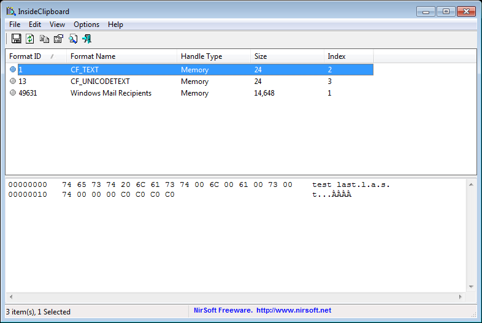
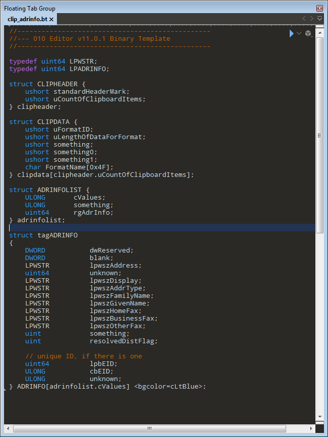
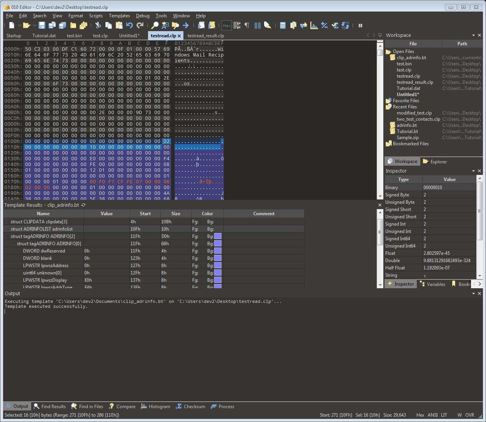
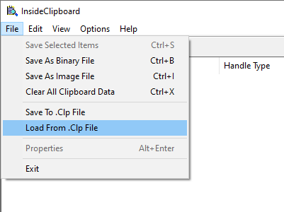
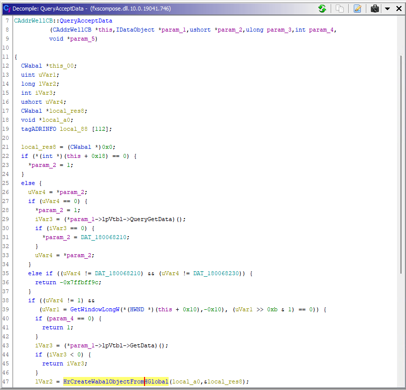
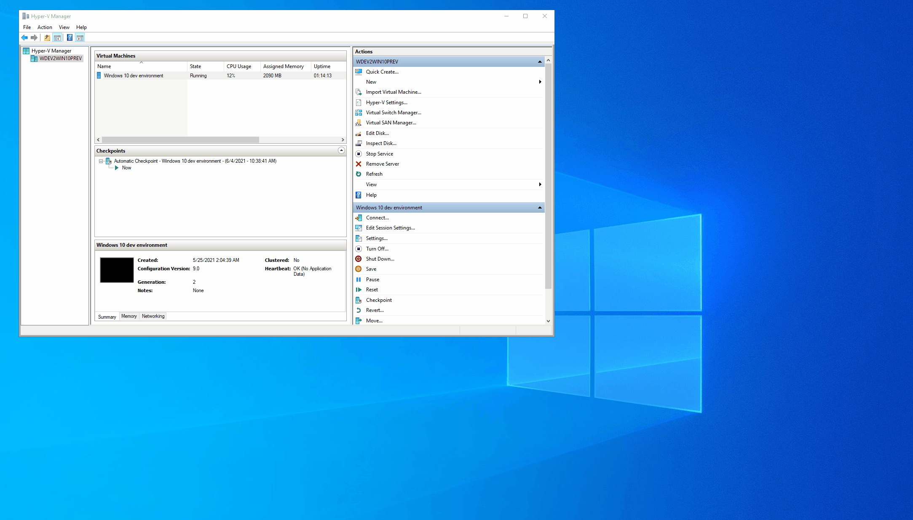
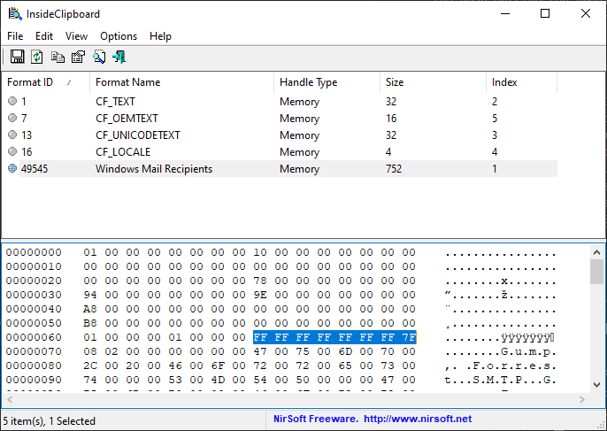

# Patch Diffing in the Dark 
---
# CVE-2021-1657 - Part 4 - Do you trust me?
created: 2021-05-29
author: John M


<sub>*Photo by [Vincent Chin](https://unsplash.com/@vchin0709?utm_source=unsplash&utm_medium=referral&utm_content=creditCopyText) on [Unsplash](https://unsplash.com/s/photos/stars-dark?utm_source=unsplash&utm_medium=referral&utm_content=creditCopyText)*</sub>

## Do You Trust Me?
In the previous [three](Patch%20Diffing%20In%20the%20Dark%20-%20CVE-2021-1657.md) [blog](Patch%20Diffing%20in%20the%20Dark%20-%20CVE-2021-1657%20-%20Part%202%20-%20Down%20the%20Rabbit%20Hole.md) [posts](Patch%20Diffing%20in%20the%20Dark%20-%20CVE-2021-1657%20-%20Part%203%20-%20Down%20But%20Not%20Out.md), we have been on the path set by the compass of CVE-2021-1657.   We have explored several functions in and around our CVE and  found our assumed integer overflow, which led to a distinct heap buffer overflow (3 overflows actually). I think we have provided sufficient evidence for my [claims](Patch%20Diffing%20In%20the%20Dark%20-%20CVE-2021-1657.md#Putting%20My%20Money%20Where%20My%20Mouth%20Is) that patch diffing leads to vulnerability comprehension and discovery.  This last post in the series on CVE-2021-1657 is for fun and hopefully demonstrates what can happen when you start to fully understand the code base. It is at this point you can see just a little clearer, apply a bit of creativity, and perhaps squeeze one more vulnerability from the security relevant section of code highlighted by CVE-2021-1657.  Let's begin. 

### The Danger of Copy/Paste

On the path to heap overflow discoveries in [Part 3](Patch%20Diffing%20in%20the%20Dark%20-%20CVE-2021-1657%20-%20Part%203%20-%20Down%20But%20Not%20Out.md), we had to learn about the Windows Clipboard.  It turned out that the way we achieved our first integer overflow directly resulted from the copy/paste of several large Windows Contacts files, or at least their internal in-memory representation in `HrBuildHGlobal`.  Essentially, we used the Windows Clipboard to circumvent the memory [limitations](Patch%20Diffing%20in%20the%20Dark%20-%20CVE-2021-1657%20-%20Part%202%20-%20Down%20the%20Rabbit%20Hole.md#Large%20Single%20Element%20Allocations) and file creation [issues](Patch%20Diffing%20in%20the%20Dark%20-%20CVE-2021-1657%20-%20Part%202%20-%20Down%20the%20Rabbit%20Hole.md#Not%20All%20Elements%20Created%20Equal) we had when trying to create and load several GB Windows Contacts XML files. If the Windows Clipboard helped us overcome our previous issues, what else could it do for us? How did the clipboard manage the Windows Contacts in memory?  Could we use the Windows Clipboard to manipulate the Windows Contacts?

### Is it safe?

When I started looking through the MSDN documentation, I [found](https://docs.microsoft.com/en-us/windows/win32/api/ole2/nf-ole2-olegetclipboard) an immediately promising quote.


Later, I found several other dangers of clipboard data.  The clipboard is accessible system wide, locally by user processes with low integrity levels, over the network when using RDP, and across the virtual machine security boundary from guest to host [via *rdpclip.exe*](https://docs.microsoft.com/en-us/openspecs/windows_protocols/ms-rdsod/e4c9d4d6-c025-497d-9981-ece9848fa91e). 


<sub>_Figure 1. Architecture of clipboard sharing in Microsoft RDP (source:_ [_Reverse RDP Attack: Code Execution on RDP Clients_](https://research.checkpoint.com/reverse-rdp-attack-code-execution-on-rdp-clients/)_)_</sub>

>Moreover, every time a clipboard is updated on either side of the RDP connection, a message is sent to the other side to notify it about the new clipboard formats that are now available. This means that a malicious server is notified whenever the client copies something to the clipboard, which the server can then query and read. [A case study in industry collaboration: Poisoned RDP vulnerability disclosure and response - Microsoft Security](https://www.microsoft.com/security/blog/2019/08/07/a-case-study-in-industry-collaboration-poisoned-rdp-vulnerability-disclosure-and-response/)

[CVE-2019-0887](https://cve.mitre.org/cgi-bin/cvename.cgi?name=CVE-2019-0887)  abused the clipboard to obtain remote code execution via the clipboard and Microsoft [responded](https://www.microsoft.com/security/blog/2019/08/07/a-case-study-in-industry-collaboration-poisoned-rdp-vulnerability-disclosure-and-response/) with a blog post and updates to [Windows Event Tracing](https://docs.microsoft.com/en-us/windows/win32/etw/about-event-tracing) to better identify clipboard abuse.  All this to say, **clipboard data is untrusted and dangerous.**

## Variant of CVE-2021-1657?

Our study of `HrBuildHGlobal` [taught us](Patch%20Diffing%20in%20the%20Dark%20-%20CVE-2021-1657%20-%20Part%203%20-%20Down%20But%20Not%20Out.md#CVE-2021-XXXX%20Heap%20Buffer%20Overflow%20via%20Integer%20Overflow%20-%20CWabal%20HrBuildHGlobal) how Windows Contacts construct and constrain objects in memory, and how they interact with the Windows Clipboard. Further study of this function reveals something quite interesting. It turns out there is a section of code in `HrBuildHGlobal` that is quite similar to the vulnerability [patched in CVE-2021-1657](Patch%20Diffing%20in%20the%20Dark%20-%20CVE-2021-1657%20-%20Part%202%20-%20Down%20the%20Rabbit%20Hole.md#Additional%20Bounds%20Check%20Preventing%20Heap%20Buffer%20Overflow). 

```c
uVar1 = puVar4->cbEID;
if (uVar1 != 0) {
  puVar4->lpEID = (void *)(ulonglong)uVar4;
  memcpy(local_res20,(void *)CONCAT44(uStack76,uStack80),(ulonglong)uVar1);
  local_res20 = local_res20 + uVar1;
  uVar4 = uVar4 + uVar1;
  local_res18[0] = uVar4;
}
```
<sub>*`HrBuildHGlobal` in primary loop serializing contacts in the Fax Compose Form*</sub>

This code looks much more like the vulnerable code found in `HrDupeAdrInfo` from the vulnerable `fxcompose.dll` 10.0.19041.508. 

```c
  if (param_1->cbEID != 0) {
    *(short **)&(*param_2)->lpEID = _Dst;
    (*param_2)->cbEID = param_1->cbEID;
    memcpy(_Dst,param_1->lpEID,(ulonglong)param_1->cbEID);
  }
  return 0;
```
<sub>*`HrDupeAddrInfo` in vulnerable  `fxcompose.dll - 10.0.19041.508`*</sub>

### Clipboard Basics
After spending several days digging into the [Windows Clipboard](https://docs.microsoft.com/en-us/windows/win32/dataxchg/clipboard) and learning how to [use it](https://docs.microsoft.com/en-us/windows/win32/dataxchg/using-the-clipboard), I was able to gain a better understanding of the purpose of `HrBuildHGlobal` and how the function runs within `WFS.exe`. This function creates, or as its name implies,  "`HrBuild`"s an [HGLOBAL](https://docs.microsoft.com/en-us/windows/win32/api/winbase/nf-winbase-globalhandle). A `HGLOBAL` is a [handle](https://docs.microsoft.com/en-us/windows/win32/sysinfo/handles-and-objects) (or kernel object) pointing to a memory allocation. This handle type is used with the Windows Clipboard as a [storage medium](https://docs.microsoft.com/en-us/windows/win32/api/objidl/ns-objidl-ustgmedium-r1) for inter-process communication ([IPC](https://docs.microsoft.com/en-us/windows/win32/ipc/interprocess-communications#using-the-clipboard-for-ipc)). Now  IPC and the Windows Clipboard could be a [whole](https://devblogs.microsoft.com/oldnewthing/20200226-00/?p=103489) [series](https://masteringonoops.wordpress.com/2014/09/19/ipc-in-windows-using-clipboard-and-data-copy/) of [blog](https://devblogs.microsoft.com/oldnewthing/20181130-00/?p=100365) [posts](https://docs.microsoft.com/en-us/windows/win32/dataxchg/standard-clipboard-formats) in and of itself, but instead we will skim the surface to get a point across.

 In short, `HrBuildHGlobal` serializes Windows Contacts (internally represented as `ADRINFO` data structures) within the *Fax Compose Form* and makes them available via a clipboard data object. Specifically, on the copy operation, a [SetClipboard](https://docs.microsoft.com/en-us/windows/win32/api/ole2/nf-ole2-olesetclipboard) method places an [IDataObject](https://docs.microsoft.com/en-us/windows/win32/api/objidl/nn-objidl-idataobject) on the Windows Clipboard.  The `ADRINFO` data isn't present at the time of placement, rather an IDataObject COM object that exposes a  method [`GetData`](https://docs.microsoft.com/en-us/dotnet/api/microsoft.visualstudio.shell.oledataobject.microsoft-visualstudio-ole-interop-idataobject-getdata?view=visualstudiosdk-2019). When `WFS.exe` (or any other application) calls the [paste operation](https://docs.microsoft.com/en-us/windows/win32/api/richole/nf-richole-iricheditolecallback-queryacceptdata), the `GetData` method from the clipboard IDataObject invokes `HrBuildHGlobal`, which then provides serialized `ADRINFO` objects.
 
To hit this so called variant in `HrBuildHGlobal` to cause a similar heap buffer overflow, you would have to manipulate the `ADRINFO` object in memory, which is difficult to do using the standard load contact mechanisms as [demonstrated](Patch%20Diffing%20in%20the%20Dark%20-%20CVE-2021-1657%20-%20Part%202%20-%20Down%20the%20Rabbit%20Hole.md#Problems) several times before.  We can't use the trick that caused the heap overflow vulnerability in CVE-2021-1657. The `cbEID` length (set by the file path length of the Windows Contact file) is now checked within the patched `HrDupeAddrInfo` preventing such Contacts from ever reaching the vulnerable `HrBuildHGlobal`. For this reason, I can't see how to take advantage of this variant *in the same way*.  That being said, **what could we do if we had full control of the `ADRINFO` structure** rather than simply the `cbEID` member of the data structure? 

### Clipboard IPC - With Great Power Comes Great Responsibility 

Now that we know this function is providing the data for copy/paste operations, we need a tool to analyze it. I found a seemingly ancient utility called [Insideclipboard](https://www.nirsoft.net/utils/inside_clipboard.html).  

>InsideClipboard is a small utility that displays the binary content of all formats that are currently stored in the clipboard, and allow you to save the content of specific format into a binary file. [InisdeClipboard](https://www.nirsoft.net/utils/inside_clipboard.html)

Exactly what I needed. (Later I found out that I wasn't the only one to [find use](https://i.blackhat.com/USA-19/Wednesday/us-19-Baril-He-Said-She-Said-Poisoned-RDP-Offense-And-Defense.pdf) in the utility for security research).

#### InsideClipboard
Essentially, the application monitors the clipboard for changes, and copies the data off to view or to save, mimicking a `CTRL-V`. Highlighting the contacts within the *Fax Compose Form* inside clipboard would allow me to see the contents of the clipboard that had been creating from `WFS.exe`. It allowed for a brief look at the data and even the ability to save the data in its own proprietary [format](https://docs.microsoft.com/en-us/windows/win32/dataxchg/clipboard-formats).  



All data on the clipboard is registered with a particular format, for `WFS.exe` contacts, it is `Windows Mail Receipients`.

```c
UVar10 = RegisterClipboardFormatW(u_Windows_Mail_Recipients_180068270);
```
<sub>*Ghidra Decompilation - `RegisterClipboardFormatW` Capture of Call within WMCREATE in `fxscompose.dll`*</sub>

#### 010 Editor Templating `ADRINFO`
From the `.clp` file created by InsideClipboard, I could see the serialized `ADRINFO` data. I leveraged a utility called [010 Editor](https://www.sweetscape.com/010editor/) to build a template, leveraging previous knowledge of the structure, that allows for easy viewing of the data. 





This was a challenge, but to cut another long story short, I learned how to create these HGLOBAL objects, giving me control of the construction of an internal Windows Contact data structure outside the typical restricted load mechanisms. 



Leveraging these tools, we now can create, modify, and even load the `ADRINFO` data structures onto the clipboard to send directly to the *Fax Compose Form*.  


## CVE-2021-ZZZZ - Deserialization of Untrusted Data 

OK, so here we go. We know how to create our own clipboard data for `Windows Mail Recipients` and are no longer constrained by the standard methods of loading a contact. During our quest to prove the integer overflow, we found a solution connecting the Windows Clipboard IPC and the function `HrBuildHGlobal`. The analysis of that function taught us how to build serialized data representing our `tagADRINFO` data structure. We are now going to walk through a brand new vulnerability and a few more vulnerability classes. Welcome to the madness of [deserialization of untrusted data](https://cwe.mitre.org/data/definitions/502.html). 

### What happens on CTRL-V?



Taking a look once again in *Ghidra*, we can see the set of functions that handle a paste operation from the user within `WFS.exe`:
- [WM_PASTE message](https://docs.microsoft.com/en-us/windows/win32/dataxchg/wm-paste)  to the *Fax Compose Form* 
- `CAddrWellCB::QueryAcceptData` - Get paste IDataObject
	- `QueryGetData` - Get relevant format of clipboard data
	- `GetData`  - Retrieves the data from the IDataObject
	- `HrCreateWabalObjectFromHGlobal` - creates an internal `Wabal` class from the `HGLOBAL` data provided via the clipboard.


Taking a look at some at the decompilation helps us figure out the details of `HrCreateWabalObjectFromHGlobal` (the function attempting to reconstruct our serialized `ADRINFO` data).

```c
// create new list and copy data
memcpy(lpAdrNewList, lpAdrlistFromGlobal, size & 0xffffffff);
lpAdrNewList->adrinfo = (tagADRINFO *)(&lpAdrNewList + &lpAdrNewList->adrinfo);
ptVar4 = lpAdrNewList->adrinfo;                         // [1]

if (lpAdrNewList->count != 0)
{
    pAdrInfo = (tagADRINFO *)&ptVar4->lpwszDisplay;    
    current_count = 0;

    // patch up offsets + address of lpAdrNewList
    do                                                  // [2]
    {
        if (pAdrInfo[-1].lpbEID != 0) 
        {
            pAdrInfo[-1].lpbEID += lpAdrNewList         // [3]
        }
        if (*(longlong *)pAdrInfo != 0)
        {
            *(ulonglong *)pAdrInfo += lpAdrNewList 
        }
        if (pAdrInfo->lpwszAddress != (short *)0x0)     
        {
            pAdrInfo->lpwszAddress += lpAdrNewList 
        }
        if (pAdrInfo->unknown != 0)
        {
            pAdrInfo->unknown += lpAdrNewList 
        }
        if (pAdrInfo->lpwszDisplay != (WCHAR *)0x0)
        {
            pAdrInfo->lpwszDisplay += lpAdrNewList           
        }
        if (pAdrInfo->lpwszGivenName != (short *)0x0)
        {
            pAdrInfo->lpwszGivenName += lpAdrNewList 
        }
        if (pAdrInfo->lpwszFamilyName != (short *)0x0)
        {
            pAdrInfo->lpwszFamilyName += lpAdrNewList 
        }
        if (pAdrInfo->lpwszType != (short *)0x0)
        {
            pAdrInfo->lpwszType += lpAdrNewList 
        }
        if (pAdrInfo->lpwszBusinessFax != (short *)0x0)
        {
            pAdrInfo->lpwszBusinessFax += lpAdrNewList  
        }
        current_count = current_count + 1;
        pAdrInfo = pAdrInfo + 1;
    } while (current_count < lpAdrNewList->count);
```
<sub>Figure 1 - `HrCreateWabalObjectFromHGlobal` decompilation</sub>

Within `HrCreateWabalObjectFromHGlobal`, as its name implies, serialized `HGLOBAL` data from the clipboard is translated to N number of `ADRINFO` data structures.  The "`lp`" type pointers (such as `lpwszAddress`) are stored as `long long` 8 byte integer offsets.  The `ADRINFO` data structures that contain offsets to its  members are updated (such as line [3]) throughout the loop [2] transforming offsets to actual virtual memory addresses within `WFS.exe`.

Visually, this `HGLOBAL` allocation has the following *assumed* layout in memory:

```mermaid

flowchart LR;
linkStyle default interpolate basis

subgraph Serialized HGLOBAL
  ADRINFOLIST
  ADRINFO_0
  ADRINFO_1
  ADRINFO_N
  DATA_0
  DATA_1
  DATA_N
end
```
<sub>*Figure 2 - Serialized HGLOBAL containing `ADRINFOLIST`, `ADRINFO`, and corresponding data*</sub> 

The assumption that the `HGLOBAL` allocation is trusted and well formed is the underlying issue. Clipboard data is not to be trusted. Using our new understanding of how the `ADRINFO` objects are reconstructed, we can play a few games either by once [again](Patch%20Diffing%20in%20the%20Dark%20-%20CVE-2021-1657%20-%20Part%202%20-%20Down%20the%20Rabbit%20Hole.md#Additional%20Bounds%20Check%20Preventing%20Heap%20Buffer%20Overflow) abusing `ADRINFO->cbEID` and `ADRINFO->lpEID` or other "`lp`" type pointers within the structure. Specifically, we can now produce the following vulnerabilities via a well placed *CTRL-V*. 

- Targeted [Information Disclosure](https://cwe.mitre.org/data/definitions/200.html)
- [Out-of-Bounds Write](https://cwe.mitre.org/data/definitions/787.html)
- [Denial of Service](https://cwe.mitre.org/data/definitions/248.html)

### Information Disclosure
One incorrect assumption in *Figure 2* above is that the `ADRINFO` offsets point to data **within** the provided serialized HGLOBAL allocation on the heap. There is no reasonable limitation for the offsets, they are of type `long long` and can be set to **any 8 byte offset** +/- the HGLOBAL heap allocation starting address (returned by the [GlobalLock](https://docs.microsoft.com/en-us/windows/win32/api/winbase/nf-winbase-globallock) call within `HrCreateWabalObjectFromHGlobal`).

```mermaid

flowchart TD;
linkStyle default interpolate basis

ADRINFO_0--lpwszDisplay-->SensitiveData
ADRINFO_1--lpbEID-->HeapData
ADRINFO_N--lpwszBusinessFax-->ImageData

subgraph Serialized HGLOBAL
  ADRINFOLIST
  ADRINFO_0 
  ADRINFO_1
  ADRINFO_N
  DATA_0
  DATA_1
  DATA_N
end

SensitiveData
HeapData
ImageData
```
<sub>*Figure 2a - Serialized HGLOBAL with `ADRINFO` `lp` type pointers set to read sensitive data*</sub> 

This sensitive data is then stored in an internal class named `CWabal` and mapped to the now corrupt in-memory contact within the *Fax Compose Form*. In order to disclose the sensitive information, a subsequent copy of the contact is necessary. Perhaps a bit of a stretch, but still possible. 

[](images/CVE-2021-1657/out_of_bounds_info_d2.gif)

<sub> Information disclosure in action.</sub>

The above animation shows an attacker from a Hyper-V Guest loading up the clipboard with data that causes a targeted information disclosure from the host. Each time the malicious clipboard data is copied to the *Windows Fax Compose Form*, the sensitive heap data is captured. In this example, the data is actually displayed as the contact name in the form (it could also be hidden). Finally, the contacts are copied and immediately disclosed to the Hyper-V Guest clipboard. 


### Out-of-bounds Writes

#### HGLOBAL Too Small

```mermaid

flowchart TD;
linkStyle default interpolate basis

subgraph Serialized HGLOBAL
  ADRINFOLIST
end
  ADRINFO_0 
  ADRINFO_1
  ADRINFO_N
  DATA_0
  DATA_1
  DATA_N

```
<sub> *Figure 3 - Out-of-bounds write via `HGLOBAL` memory allocation being too small*</sub>

Another incorrect assumption is that the serialized `HGLOBAL` allocation is large enough to hold the N number of `ADRINFO` data structures. The size of the allocation can be controlled by the attacker setting the data on the clipboard. In a case where `ADRINFOLIST->cValues` == N, but space only is allocated for the `ADDRINFOLIST` header, the processing of the "assumed" present ADDRINFO data structures will cause out-of-bounds writes. 

The out of bounds writes occur each time a pointer is translated from an offset to an actual address outside the HGLOBAL allocation. This corrupts data on the heap at various ADRINFO offsets ( such as `lpAdrInfo->lpwszAddress`) by adding the starting address of the newly allocated `lpAdrInfoListNew` to whatever data exists on the heap in the relative patched locations [3]. 

#### Start Somewhere Else

```mermaid

flowchart TD;
linkStyle default interpolate basis

ADRINFOLIST--rgAdrInfo-->SomewhereElse

subgraph Serialized HGLOBAL
  ADRINFOLIST
  ADRINFO_0 
  ADRINFO_1
  ADRINFO_N
  DATA_0
  DATA_1
  DATA_N
end
```
<sub> *Figure 4 - Out-of-bounds write via `ADDRINFOLIST->rgAdrInfo` pointing somewhere else in memory*</sub>

An out-of-bounds write can also be achieved *without* modifying the serialized HGLOBAL allocation size. As in the information disclosure example above, the out-of-bounds write can occur at any offset +/- 8 byte (`long long`) from the starting address of the HGLOBAL allocation [1].  In Figure 1, the pointer `lpAdrInfo` is set via `ADDRINFOLIST->rgAdrInfo` [2] and once again treated initially as an offset. Once again, entering the loop [1] would cause several out of bounds writes at the offsets specified be an attacker. 

### Denial Of Service

```mermaid

flowchart TD;
linkStyle default interpolate basis

ADRINFO_0--lpEID-->SomeKernelAddress


subgraph Serialized HGLOBAL
  ADRINFOLIST
  ADRINFO_0 
  ADRINFO_1
  ADRINFO_N
  DATA_0
  DATA_1
  DATA_N
end
```
<sub> *Figure 5 - Access Violation - `ADRINFO->lpEID` pointing to kernel address*</sub>

This is the simplest vulnerability, make it crash. Modifying any of the offsets for the "`lp`" type pointers, we set `ADRINFO->lpEID` to 0x7FFFFFFFFFFFFFFF (max signed `long long`).  When the offset is translated to an actual pointer, it will resolve to a kernel address [3]. 

Load it up in *Insideclipboard.exe*. 


*CTRL-V* inside the *Fax Compose Form*...

```
(1d98.2418): Unknown exception - code c000041d (!!! second chance !!!)
msvcrt!memcpy+0x92:
00007ff8`b4704452 0f100411        movups  xmm0,xmmword ptr [rcx+rdx] ds:80000222`d6846e3f=????????????????????????????????
```
<sub>*WinDbg Command Window- `memcpy` attempting to read from kernel address `0x80000222d6846e3f`*</sub>

Yep. **Boom.**


## Sunsetting CVE-2021-1657

Alright, we have spent enough time looking at CVE-2021-1657. We have shaken the patch diffing tree and several vulnerabilities have come out.  What started out as an afternoon project turned out to be quite a bit of research and follow on discovery. Hopefully, you have been inspired to give patch diffing a try, or at least have learned either some new tricks or details about the various vulnerability classes demonstrated along the way.  Until next time...
